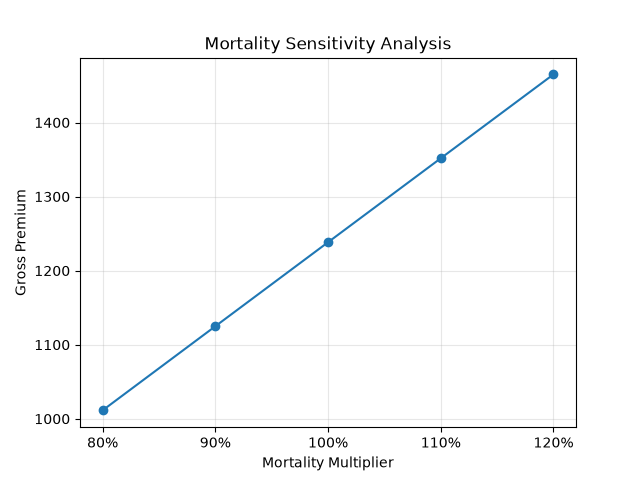
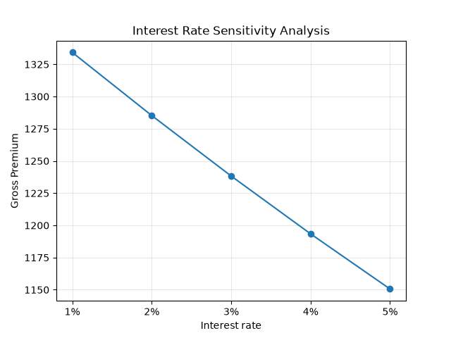

# Term Life Insurance Pricing Model

A Python-based actuarial project for pricing term life insurance using mortality data, survival probabilities, and discounted expected cash flows.

The model calculates net and gross annual premiums and performs sensitivity analysis on mortality and interest rate assumptions.

## Features

- Calculates net and gross annual premiums for term life insurance
- Uses age- and gender-specific mortality rates from a mortality table
- Incorporates survival probabilities and discounted expected death benefits
- Allows user-defined assumptions for entry age, gender, sum assured, policy term, interest rate, and mortality multiplier
- Performs mortality sensitivity analysis from 80% to 120% of the base mortality assumption
- Performs interest rate sensitivity analysis from 1% to 5%
- Exports pricing and sensitivity analysis results to CSV files
- Generates sensitivity analysis charts using Matplotlib
- Includes input validation and basic model sanity checks

## Methodology

For each policy year, the model calculates the probability that the insured survives to the beginning of the year and then dies during that year.

The expected death benefit in policy year \(t\) is calculated as:

Expected Claim = Sum Assured × Survival Probability × Mortality Rate

The expected claim is then discounted to the policy issue date using the assumed interest rate:

Present Value of Expected Claim = Expected Claim / (1 + i)^t

The present values of expected claims are summed across the policy term to obtain the expected present value of death benefits.

The net annual premium is calculated using the equivalence principle:

Net Annual Premium = EPV of Death Benefits / EPV of Premium Payments

A fixed annual expense assumption is then added to derive the gross annual premium.

## Assumptions

- Premiums are paid annually at the beginning of each policy year while the policyholder is alive.
- Death benefits are assumed to be paid at the end of the year of death.
- Mortality rates vary by attained age and gender and are loaded from the mortality table.
- A constant annual interest rate is assumed throughout the policy term.
- A fixed annual expense of 100 is included in the gross premium calculation.
- No lapses, commissions, profit margins, taxes, or other expenses are modeled.

## Mortality Data

The model uses age- and gender-specific mortality rates from the Taiwan Life Insurance Industry 7th Experience Mortality Table, published by the Financial Supervisory Commission (FSC) of Taiwan.

Mortality rates are represented by qx, the probability that an individual aged x dies within the following year. Separate mortality rates are used for males and females.

The mortality multiplier allows the base mortality rates to be stressed for sensitivity analysis.

Source: [Financial Supervisory Commission (Taiwan) — Taiwan Life Insurance Industry 7th Experience Mortality Table](https://law.fsc.gov.tw/LawContent.aspx?id=GL004139)

## Sensitivity Analysis

The model evaluates how changes in key actuarial assumptions affect the gross annual premium.

### Mortality Sensitivity

Mortality rates are tested at 80%, 90%, 100%, 110%, and 120% of the base mortality assumption.

As mortality increases, the expected cost of death benefits increases, resulting in a higher gross premium.

### Interest Rate Sensitivity

Interest rates of 1%, 2%, 3%, 4%, and 5% are tested while holding other assumptions constant.

As the interest rate increases, the present value of future death benefits decreases, resulting in a lower gross premium.

## Project Structure

- `pricing_functions.py` — Contains reusable functions for loading mortality data and calculating premiums
- `pricing_model.py` — Interactive pricing calculator with user-defined assumptions and input validation
- `sensitivity_analysis.py` — Performs mortality and interest rate sensitivity analyses and generates charts
- `mortality_table.csv` — Contains age- and gender-specific mortality rates
- `pricing_result.csv` — Stores the output from the pricing calculator
- `mortality_sensitivity.csv` — Stores mortality sensitivity analysis results
- `interest_sensitivity.csv` — Stores interest rate sensitivity analysis results
- `mortality_sensitivity.png` — Mortality sensitivity analysis chart
- `interest_sensitivity.png` — Interest rate sensitivity analysis chart
- `requirements.txt` — Lists the required Python packages

## How to Run

1. Clone or download this repository.

2. Install the required Python packages using `pip install -r requirements.txt`.

3. Run the interactive pricing calculator using `python pricing_model.py`.

4. Enter the requested assumptions, including gender, entry age, sum assured, policy term, interest rate, and mortality multiplier.

5. Run the sensitivity analysis using `python sensitivity_analysis.py`.

The model will display the results and export the corresponding CSV files and sensitivity analysis charts.

## Limitations

This project is a simplified actuarial pricing model developed for educational and portfolio purposes.

The model assumes a constant interest rate and does not incorporate policy lapses, commissions, profit margins, taxes, capital requirements, or other product-specific expenses.

The gross premium calculation includes only a fixed annual expense and therefore should not be interpreted as a commercial insurance premium.